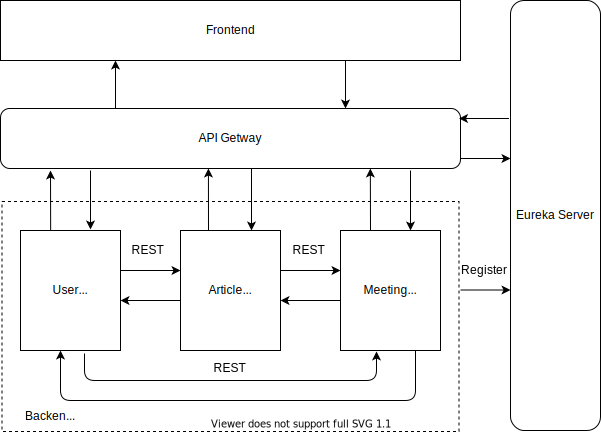
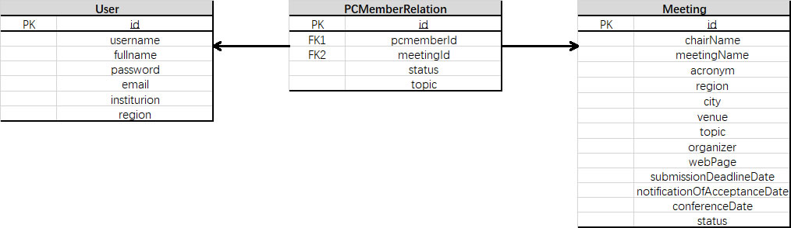
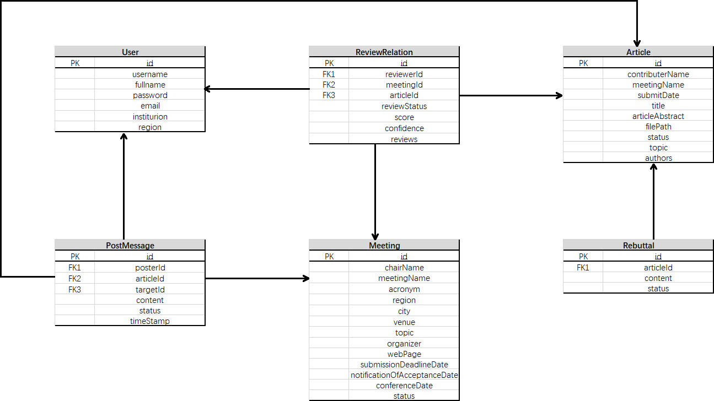
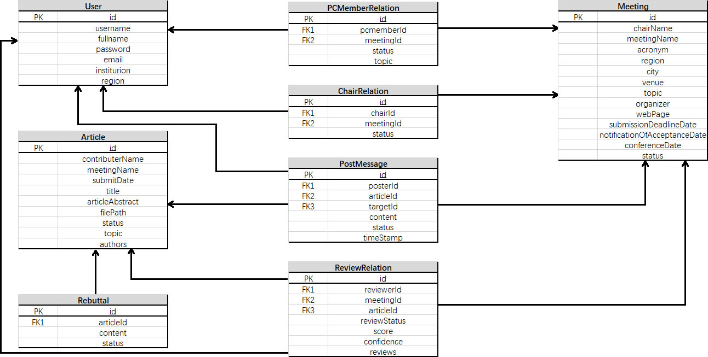

## 服务设计文档

[TOC] 

### 功能概述

该项目为学术会议网站，主要提供为学术会议的申请和开展，具体功能有：用户注册登录、会议申请、管理员审核会议申请、开启投稿、邀请pc、用户查收邀请、论文投稿、开启审稿、审稿、结束审稿、讨论、发布初次评审结果、Rebuttal、发布最终结果等。

整个服务结构从前端到后端依次有Frontend、APIGateway、Eureka、UserService、ArticleService、MeetingService。服务之间通过REST进行交互，整个服务结构如下。

### 功能结构

#### Frontend

Frontend服务是整个网站的前端服务，负责与用户之间的直接交互，并且将用户的请求发送到API Gateway服务。

#### API Gateway

API Gateway服务是网站的API网关服务，将用户与Frontend交互所产生的请求分类并转发至正确的服务，同时接受后端服务发送的信息并转发到前端。

#### Eureka

Eureka作为API Gateway和后端服务之间的媒介，辅助API Gateway调用UserService、ArticleService和MeetingService。

#### UserService

UserService服务提供的是用户信息管理服务，主要包括注册、登录、查询用户、查询用户相关信息和更新用户相关信息等与用户相关的功能，并与API Gateway和其他后端服务进行交互。

#### ArticleService

ArticleService服务提供的是文章信息管理服务，主要包括提交文章、更新文章、查询文章、查询文章相关信息以及更新文章相关信息等与文章相关的功能，并与API Gateway和其他后端服务进行交互。

#### MeetingService

ArticleService服务提供的是会议信息管理服务，主要包括新建会议、审批会议、更新会议和会议相关信息、更新会议状态、查询会议和会议相关信息、邀请用户、查询邀请信息等与会议相关的功能，并与API Gateway和其他后端服务进行交互。

### 数据库设计

UserService、ArticleService和MeetingService三个服务分别拥有并维护自己的数据库用于提供相应服务，并且当一个服务的数据库发生变化时，会同步对其他服务的相同数据库进行更新。

#### UserService

UserService服务数据库维护以下三个Table：

+ User：用户信息
+ PCMemberRelation：会议参与者信息
+ Meeting：会议信息

关系如下图所示：

#### ArticleService

ArticleService服务数据库维护以下六个Table：

+ User：用户信息
+ ReviewRelation：Review关系信息
+ Meeting：会议信息
+ PostMessage：投稿信息
+ Article：文章信息
+ Rebuttal：Rebuttal信息

关系如下图所示：

#### MeetingService

MeetingService服务数据库维护以下八个Table：

+ User：用户信息
+ ReviewRelation：Review关系信息
+ Meeting：会议信息
+ PostMessage：投稿信息
+ Article：文章信息
+ Rebuttal：Rebuttal信息
+ PCMemberRelation：会议其参与者信息
+ ChairRelation：会议Chair信息

关系如下图所示

### 接口概述

#### UserService

| URI                              | Http Method | Description                                 |
| -------------------------------- | ----------- | ------------------------------------------- |
| /welcome                         | GET         | 获取欢迎消息                                |
| /register                        | POST        | 注册新用户                                  |
| /login                           | POST        | 用户登录                                    |
| /user/userinfo                   | GET         | 通过用户名获取用户信息                      |
| /user/userinfoByID               | GET         | 通过用户ID获取用户信息                      |
| /user/userinfoByEmail            | GET         | 通过邮箱获取用户信息                        |
| /user/undealedNotifications      | GET         | 获取程序委员 pc member 所有未处理的邀请消息 |
| /user/undealedNotificationsNum   | GET         | 获取程序委员 pc member 未处理邀请消息的数量 |
| /user/userinfoByFullnameAndEmail | GET         | 通过全名和邮箱获取用户信息                  |
| /util/users                      | GET         | 通过全名获取多个用户信息                    |

#### ArticleService

| URL                                       | Http Method | Description                                   |
| ----------------------------------------- | ----------- | --------------------------------------------- |
| /welcome                                  | GET         | 获取欢迎消息                                  |
| /meeting/application                      | POST        | 添加新的会议                                  |
| /meeting/meetingInfo                      | GET         | 获取会议信息                                  |
| /meeting/saveMeeting                      | POST        | 保存会议                                      |
| /meeting/meetingInfoById                  | GET         | 通过会议ID获取会议信息                        |
| /meeting/pcmInvitation                    | POST        | 向程序委员 pc member 发送邀请                 |
| /meeting/invitationStatus                 | GET         | 获取会议中所有程序委员 pc member 的邀请状态   |
| /admin/queueingApplication                | GET         | 获取所有待处理会议的信息                      |
| /admin/alreadyApplication                 | GET         | 获取所有已处理会议的信息                      |
| /admin/ratify                             | POST        | 审批已存在的会议                              |
| /meeting/chairMeeting                     | GET         | 获取会议主席 chair 的所有会议信息             |
| /meeting/pcMemberMeeting                  | GET         | 获取程序委员 pc member 的所有会议信息         |
| /meeting/authorMeeting                    | GET         | 获取文稿作者 author 的所有会议信息            |
| /meeting/availableMeeting                 | GET         | 获取用户可投稿的所有会议信息                  |
| /meeting/undealedNotifications            | GET         | 获取程序委员 pc member 所有未处理的邀请信息   |
| /meeting/beginSubmission                  | POST        | 会议开始接受投稿                              |
| /meeting/invitationRepo                   | POST        | 处理程序委员 pc member 所有未处理的邀请       |
| /meeting/alreadyDealedNotifications       | GET         | 获取程序委员 pc member 所有已处理的邀请信息   |
| /meeting/beginReview                      | POST        | 会议开始审稿                                  |
| /meeting/submissionList                   | GET         | 获取文稿作者 author 的投稿文章列表            |
| /meeting/publish                          | POST        | 修改会议状态为：结果已发布                    |
| /meeting/finalPublish                     | POST        | 修改会议状态为：审稿意见已发布                |
| /meeting/getPCMemberRelationByIdAndStatus | GET         | 根据ID和状态获取程序委员 pc mebmer 的关系列表 |

#### MeetingService

| URL                          | HttpMethod | Description                                   |
| ---------------------------- | ---------- | --------------------------------------------- |
| /article/articleDetail       | GET        | 获取文章信息                                  |
| /article/articleSubmission   | POST       | 提交新的文章                                  |
| /article/updateArticle       | POST       | 更新已有的文章                                |
| /article/reviews             | GET        | 获取文章的所有审稿意见                        |
| /article/reviewArticles      | GET        | 获取程序委员 pc member 的所有审稿文章信息     |
| /article/reviewArticle       | GET        | 获取程序委员 pc member 的单个审稿文章信息     |
| /article/alreadyReviewedInfo | GET        | 获取程序委员 pc member 关于单个文章的审稿意见 |
| /article/reviewer            | POST       | 提交审稿意见                                  |
| /article/reviewConfirm       | POST       | 确认审稿状态                                  |
| /article/rebuttal            | POST       | 提交辩驳意见                                  |
| /article/rebuttalInfo        | GET        | 获取文章的辩驳意见                            |
| /article/updateReview        | POST       | 更新审稿意见                                  |
| /article/reviewPost          | POST       | 发布讨论信息                                  |
| /article/postList            | GET        | 获取讨论信息                                  |

