## 框架设计文档

[TOC]

### 业务模型
整个业务流程涉及四种角色，分别为
- `admin`：系统管理员，负责会议申请的审核
- `chair`：会议主席，负责会议申请、pc邀请和流程管理，自动作为`pc_member`
- `pc_member` (reviewer)：程序委员会主席，参与审稿、讨论工作
- `author`：文稿作者，投递论文、提交rebuttal

如图所示，一次会议的业务流程分为六个阶段：

- **会议申请与审核阶段**：用户登陆系统发出会议申请，`admin`通过申请后，用户自动成为会议的`chair`和`pc_member`。

- **投稿阶段**：`chair`开启投稿，以fullname搜索用户，发出`pc member`邀请，收到邀请的用户接受邀请后成为会议的`pc member`，否则拒绝邀请；用户以`author`角色向特定会议投稿，并可查看自己投递的稿件。

- **审稿阶段**：`chair`开启审稿，选择按topic分配或平均负担分配，若分配失败需要另外邀请`pc_member`。分配成功后会议进入审稿状态。`pc_member`查看稿件，填写评分后提交；chair结束审稿，`pc_member`进入文章讨论页面进行讨论并有一次修改评分机会，最终确认评分。

- **发布初审结果阶段**：`chair`发布初审结果；`author`查看初审结果，未被录用则可提交rebuttal进行反驳；`pc_member`收到rebuttal后进入二轮讨论，对提交rebuttal的稿件重新评分，确认结果。

- **发布终审结果阶段**：`chair`发布论文最终录用情况。

- **会议结束**

### 整体构架

系统的整体构架如图所示，系统分为`网页前端`、`Eureka注册中心`、`API网关`和`后端`四个部分，其中`网页前端`负责用户交互，供用户登录、注册以及处理会议、投稿等相关事宜，并通过HTTP协议与`API网关`进行交互；`API网关`根据前端的交互信息判断需要调用的服务，接着与`Eureka注册中心`交互获取`后端`服务的注册信息，最后利用注册信息与后端特定服务进行交互，该机制简化了服务的监管与更新，可在不修改`API网关`的情况下实现服务地址的更新；`后端`共分为`UserService`、`MeetingService`和`ArticleService`三个服务，不同服务之间使用REST进行交互。

### 前端服务 (*Vue*)

为所有用户提供用户注册、登录及不同角色特有的交互操作

### 后端服务

#### UserService（*Spring+MySQL*）
与`用户信息数据库（UserRepository）`交互，提供登录、注册和用户搜索服务，并提供用户界面。

#### MeetingService（*Spring+MySQL*）
与`会议信息数据库（MeetingRepository）`和`PC关系数据库（PCMemberRelationRepository）`交互。在会议流程上，为`chair`角色提供会议申请、pc邀请、开启提交、开启审阅、初审结果发布和最终结果发布功能，为`admin`角色提供会议申请审批功能；此外`MeetingService`提供会议信息查询功能，包括会议详细信息
为chair提供的pc邀请状态、投稿状态查询，以及为admin角色提供的未处理申请、已处理申请查询。

#### ArticleService（*Spring+MySQL*）
与`稿件数据库（ArticleRepository）`、`讨论信息数据库（PostRepository）`、`Rebuttal数据库（RebuttalRepository）`、`Review数据库（ReviewRelationRepository）`交互。为`author`提供稿件提交、稿件更新、rebuttal提交功能，为`pc_member`提供审稿、审稿评分更新、审稿评分确认、讨论功能；另外提供文章相关信息查询功能，包括文章详情、文章review、文章rebuttal、讨论信息的查询。